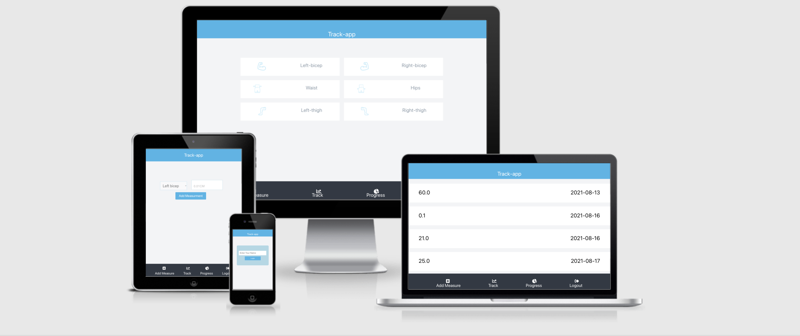

# TRACK-APP

> Track-App is an application designed to track results using back-end API. It posts and gets data for measurements like left-biceps, right-biceps, hips, waist, and thigh. It is fully responsive.

## Features

- Login with username
- Responsive design that works for Mobile, Tablet and Desktop
- Track measurement data such for Left and Right Biceps, Left and Right Thighs, Hip and Waist
- Post new measurement data

## Built With

- Node.js
- React
- React-DOM
- React-Create-App
- Hook
- npm
- CSS
- CSS module
- ES6
- Ruby On Rails Backend API ([API Rep](git@github.com:Addis0943/track-it-api.git))

## Live Demo

[Live Demo Link](https://addis-tracking-app.herokuapp.com/)

## Getting Started

To set up a local copy of the project

- `git clone git@github.com:Addis0943/Track-it-app-frontend.git `
- `cd Track-it-app-frontend`
- `Run npm install`
- `Run npm start`

To test the code

- `Run npm test`
- `Enter 'a' to see all tests `

## Author

👤 **Addis Belete**

- GitHub: [@Addis0943](https://github.com/Addis0943)
- Twitter: [@Addis32018084](https://twitter.com/Addis32018084)
- LinkedIn: [LinkedIn](https://www.linkedin.com/in/addis-belete-134b98191/)

## 🤝 Contributing

Contributions, issues, and feature requests are welcome!

Feel free to check the [issues page](../../issues/).

## Show your support

Give a ⭐️ if you like this project!

## Acknowledgments

- Hat tip to `Gregoire Vella on Behance` for his design idea
- Inspiration
- etc

## 📝 License

This project is [MIT](./MIT.md) licensed.
